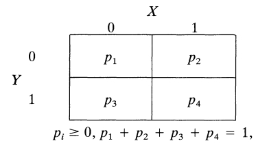

```{r setup, include=FALSE}
knitr::opts_chunk$set(echo = FALSE)
library(ggplot2)
library(dplyr)
library(truncdist)
```

## ¿Qué es el muestrador de Gibbs?

- Permite muestrar de una distribución sin tener que calcular la densidad.
- Está basada en cadenas de Markov
- Queremos muestrar de f(x)

$$ f(x) = \int \cdots \int f(x, y_1, \cdots, y_p) dy_1 \cdots dy_p $$

- ¿Qué podemos hacer?
- Resolver analítica o numéricamente, pero ¿si no se puede?


## ¿Qué es una cadena de Markov?


## ¿Cómo funciona el muestrador de Gibbs? (i)

- Ilustraremos con un ejemplo bivariado. Queremos muestras de $f(x)$ (distribuida de manera conjunta con $y$). Conocemos las condicionales $f(x|y)$ y $f(y|x)$.

- Se especifica un valor inicial para $Y'_0 = y'_0$. 

- Se obtiene apartir de las condicionales una sucesión de muestras para x e y:

$$
X'_j \sim f(x|Y'_j = y'_j)
$$
$$
Y'_{j+1} \sim f(y|X'_j = x'_j)
$$

## ¿Cómo funciona el muestrador de Gibbs? (ii)


- Obtenemos así una secuencia: $Y'_0, X'_0, Y'_1, X'_1,\cdots Y'_k, X'_k,$

- Resulta que bajo algunas condiciones generales, cuando $k \rightarrow \infty$, $X'_k$ es efectivamente una muestra de $f(x)$


## Aplicación I

- Tenemos X e Y que tienen distribuciones condicionales del tipo exponencial (restringidas al intervalo $(0,B)$:

$$
f(x|y) \propto y e^{-yx}, 0 < x < B < \infty \\
f(y|x) \propto x e^{-xy}, 0 < y < B < \infty 
$$

## Distribución

- Tomamos B = 5, se mantienen 25000 repeticiones y se desechan las primeras 1500.Los muestreos se realizan de distribuciones truncas exponenciales.

```{r include=FALSE, eval=FALSE}
B <- 5 #parámetro que trunca la dist. exponencial
k <- 15 #
R <- 500 #numero de repeticiones a mantener
iter <- R + burnin

#inicializamos los vectores donde se guardarán las sucesiones
X_vec <- vector(mode="double", length=R)
Y_vec <- vector(mode="double", length=R)


```

```{r eval=FALSE, include=FALSE}
for (i in c(1:R)) {
  y <- rtrunc(1, spec = "norm", a = 0, b = B)
  
  for (j in 1:k) {
    K_x <- 1 / (1 - exp(-B*y))
    x <- rtrunc(1, spec = "exp", a = 0, b = B, rate = y)
    K_y <- 1 / (1 - exp(-B*x))
    y <- rtrunc(1, spec = "exp", a = 0, b = B, rate = x)
  }
  X_vec[i] <- x
  Y_vec[i] <- y
}

```

```{r include=FALSE, eval=FALSE}
data_frame(val = X_vec) %>%
          ggplot(., aes(val)) + 
                geom_histogram(aes(y=..density..), binwidth = 0.5, colour="black", fill="white") + 
                 geom_density(alpha=.2, fill="#FF6666") 
```

```{r eval=FALSE, include=FALSE}
for (i in c(1:R)) {
  y <- rtrunc(1, spec = "norm", a = 0, b = B)
  
  for (j in 1:k) {
    u <- rtrunc(1, spec = "unif", a = -1, b = 1 / (1 - exp(-B*y)))
    x <- -log(1 - u * (1 - exp(-B*y))) / y
    u <- rtrunc(1, spec = "unif", a = -1, b = 1 / (1 - exp(-B*x)))
    y <- -log(1 - u * (1 - exp(-B*x))) / x
  }
  X_vec[i] <- x
  Y_vec[i] <- y
}

hist(X_vec)
```

```{r include=FALSE}
B <- 5
k <- 100
R <- 25000 #numero de repeticiones a mantener
burnin <- 1500 #observaciones a descartar
iter <- R + burnin
y <- -1 #inicializa el algoritmo

#inicializamos los vectores donde se guardarán las sucesiones
X_vec <- vector(mode="double", length=R)
Y_vec <- vector(mode="double", length=R)


```


```{r metodo_diego_wk, include=FALSE}
#algoritmo de sampling visto en clase
y <- rtrunc(1, spec = "norm", a = 0, b = B)
for (i in 1:iter) {
  K_x <- 1 / (1 - exp(-B*y))
  x <- rtrunc(1, spec = "exp", a = 0, b = B, rate = y)
  K_y <- 1 / (1 - exp(-B*x))
  y <- rtrunc(1, spec = "exp", a = 0, b = B, rate = x)  
  if (i > burnin) {
    X_vec[i] <- x
    Y_vec[i] <- y
  }
  }
  
```

```{r fig.height=3, fig.width=4}
data_frame(val = X_vec) %>%
          ggplot(., aes(val)) + 
                geom_histogram(aes(y=..density..), binwidth = 0.2, colour="black", fill="white") + 
                 geom_density(alpha=.2, fill="#FF6666") 
```


## Una prueba simple de la convergencia del muestrador de Gibbs

Mostraremos como converge el muestreo tomando como ejemplo una distribución bivariada, donde X e Y se distribuyen Bernoulli de manera conjunta.


<div class="centered">

</div>

***
La distribución conjunta de X, Y está dada por:

\[
\begin{bmatrix}f_{x,y}(0,0) & f_{x,y}(1,0)\\
f_{x,y}(0,1) & f_{x,y}(1,1)
\end{bmatrix}=\begin{bmatrix}p_{1} & p_{2}\\
p_{\text{3}} & p_{4}
\end{bmatrix}
\]

La marginal de X es:

\[
f_x = \begin{bmatrix} p_1 + p_3 & p_2 + p_4
\end{bmatrix} 
\]

Determinamos las probabilidades condicionales $X|Y = y$ e $Y|X = x$, formulando las siguientes matrices:

\[
A_{y|x}=\begin{bmatrix} Prob(Y=0|X=0) & Prob(Y=1|X=0)\\
                        Prob(Y=0|X=1)& Prob(Y=1|X=1)  
\end{bmatrix}
=
\begin{bmatrix} \frac{p_1}{p_1+p_3} & \frac{p_3}{p_1+p_3}\\
                \frac{p_2}{p_2+p_4}& \frac{p_4}{p_2+p_4}
\end{bmatrix}
\]

\[
A_{x|y}=\begin{bmatrix} Prob(X=0|Y=0) & Prob(X=1|Y=0)\\
                        Prob(X=0|Y=1)& Prob(X=1|Y=1)  
\end{bmatrix}
=
\begin{bmatrix} \frac{p_1}{p_1+p_2} & \frac{p_2}{p_1+p_2}\\
                \frac{p_3}{p_3+p_4}& \frac{p_4}{p_3+p_4}
\end{bmatrix}
\]

***

Dado que estamos interesados en muestrar de la marginal de X, nos interesan los valores $X'_0, X'_1, X'_2, \cdots$. Sin embargo, para ir de $X'_0 \rightarrow X'_1$ debemos  muestrar $Y'_1$, es decir, $X'_0 \rightarrow Y'_1 \rightarrow X'_1$. 


$$
P(X'_1 = x_1 |X'_0 = x_0) = \sum_y P(X'_1 = x_1 |Y'_1 = y) \times P(Y'_1 = y_1 |X'_0 = x_0) 
$$


Para este caso en particular, se tiene que la matrices de transición para x está dada por:

\[A_{x|x} = A_{y|x} A_{x|y}\]

Ahora, es directo calcular la distribución marginal de realización k, $X'_k$:

$f_k = f_0 A^k_{x|x} = (f_0 A^{k-1}_{x|x})A_{x|x} = f_{k-1}A_{x|x}$


***

Bajo ciertas condiciones, se tiene un punto fijo tal que:

$$ f = f A_{x|x}$$

En nuestro caso simple:


$$
\begin{aligned}
f_x A_{x|x} &=  f_x A_{y|x} A_{x|y} \\
            &=  \begin{bmatrix}
                   p_1 + p_3 & p_2 + p_4
                \end{bmatrix}
                \begin{bmatrix} 
                  \frac{p_1}{p_1+p_3} & \frac{p_3}{p_1+p_3}\\
                  \frac{p_2}{p_2+p_4}& \frac{p_4}{p_2+p_4}
                \end{bmatrix} 
                \begin{bmatrix} 
                  \frac{p_1}{p_1+p_2} & \frac{p_2}{p_1+p_2}\\
                  \frac{p_3}{p_3+p_4}& \frac{p_4}{p_3+p_4}
                \end{bmatrix} \\
            &=  \begin{bmatrix}
                   p_1 + p_2 & p_3 + p_4
                \end{bmatrix}
                \begin{bmatrix} 
                  \frac{p_1}{p_1+p_2} & \frac{p_2}{p_1+p_2}\\
                  \frac{p_3}{p_3+p_4}& \frac{p_4}{p_3+p_4}
                \end{bmatrix}\\
            &= \begin{bmatrix}
                   p_1 + p_3 & p_2 + p_4
                \end{bmatrix} \\
            &= f_x 
\end{aligned}
$$


***
